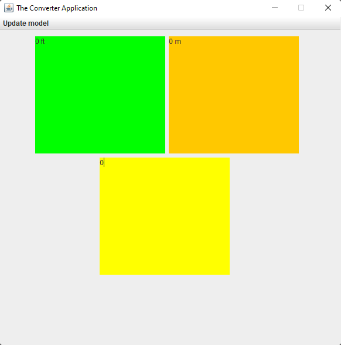
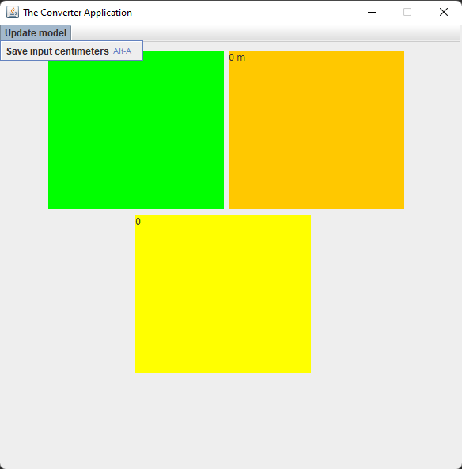
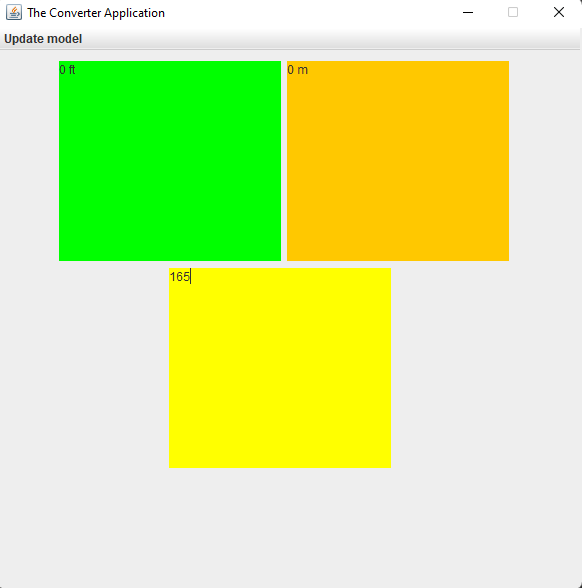
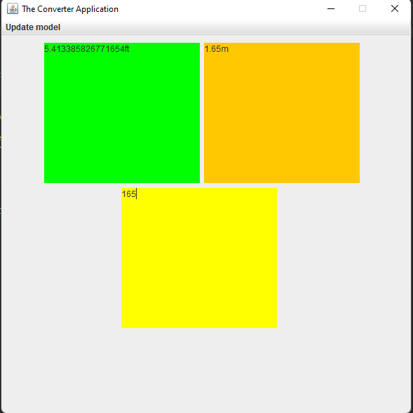

# THE CONVERTER APPLICATION

A simple Converter Application made with JAVA 16 and JAVA SWING

* Factory Design
* Singleton
* Inheritance
* Polymorphism
* Composition

## INTERFACE

| FIRST     | SECOND  |
|:------------: | :----------: |
|  |  |
| THIRD    | FOURTH    |
|  |  |

## DOCUMENTATION
