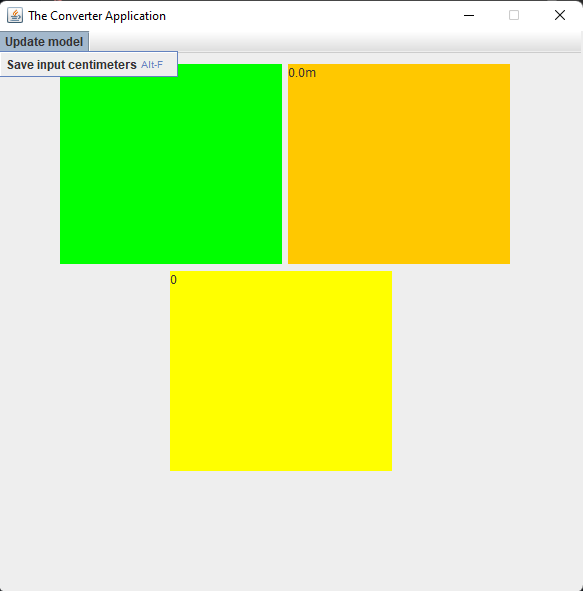

# THE CONVERTER APPLICATION

A simple Converter Application made with JAVA 16 and JAVA SWING

* Factory Design
* Singleton
* Inheritance
* Polymorphism
* Composition

## INTERFACE

| FIRST     | SECOND  |
|:------------: | :----------: |
|  |  |
| THIRD    | FOURTH    |
|  |  |

## DOCUMENTATION
- [Design report](https://github.com/sanizm/ConverterApplication/blob/master/Report/ConverterApp%20Report.docx)

## HOW TO RUN

- [TUTORIAL](https://github.com/a-mohamad/soccer-game/blob/main/Documentation/report/report.pdf)
